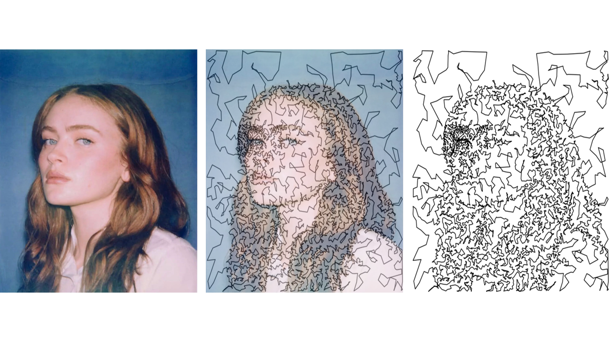

# Portrait TSP Art

**Single-stroke portrait drawing via edge-aware sampling and TSP heuristics**

This project transforms a portrait image into a **single continuous line drawing** by combining image-based importance sampling with large-scale graph optimization and geometric heuristics.  
The final output is a single polyline that visually reconstructs the portrait structure.

---

## ✨ Final Result

  

> A single closed polyline generated from approximately 8,000 sampled points.

---

## 🧠 Method Overview

The pipeline consists of five major stages:

1. Edge- and region-aware point sampling  
2. Degree-2 minimum-length graph optimization  
3. Geometric merging of disjoint cycles  
4. Local tour refinement with 2-opt  
5. High-resolution single-stroke rendering  

Each stage is designed to preserve visual structure while remaining computationally tractable at scale.

---

## 1. Edge- and Region-Aware Point Sampling

Points are sampled **non-uniformly** from the image, with higher probability assigned to visually informative regions.  
Instead of uniform sampling, a pixel-level probability distribution is constructed to reflect both structural and semantic importance.

### Structural importance
The sampling distribution emphasizes:
- strong image contours and boundaries,
- fine-scale details such as hair strands,
- local contrast and shading variations.

These signals ensure that sampled points align with edges, textures, and tonal transitions that define the portrait.

### Semantic region emphasis
To improve recognizability, semantically important regions are explicitly boosted:
- the detected face region,
- central facial features,
- the hair region above and around the face.

This prevents sampling from being wasted on low-information background areas.

### Background suppression
Flat background regions (e.g. uniform blue portrait backgrounds) are down-weighted using simple color heuristics, further concentrating samples on the subject.

### Sampling visualization

  

> Red points indicate where samples concentrate after weighting and normalization.

---

## 2. Degree-2 Graph Optimization (2-Factor Model)

After sampling, the points are connected by solving a **degree-2 minimum-length graph problem**.

The optimization enforces:
- each point has exactly two incident edges,
- the total Euclidean edge length is minimized.

This formulation produces a **2-regular graph**, which naturally decomposes into multiple disjoint cycles.

### Why a degree-2 model?
- Enforcing only degree constraints avoids expensive subtour elimination.
- The resulting cycles provide a strong global geometric structure.
- This formulation scales more reliably to thousands of points than a full exact TSP model.

---

## 3. Geometric Cycle Merging

Because the degree-2 optimization yields multiple disjoint cycles, they must be merged into a single tour.

Cycles are merged iteratively using a geometric heuristic:
- identify the closest pair of points between two cycles,
- align the cycles at these points,
- test multiple orientation combinations,
- select the merge that yields the shortest resulting path.

This process is repeated until only **one global tour** remains.

The geometric criterion ensures that merges introduce minimal distortion and preserve local continuity.

---

## 4. Local Tour Refinement (2-opt)

The merged tour may still contain crossings or inefficient detours.  
To refine the path, a **2-opt local search** procedure is applied.

This step:
- removes self-intersections,
- shortens unnecessary zig-zags,
- improves overall smoothness and visual coherence.

2-opt is particularly effective for improving aesthetic quality in large-scale drawing paths.

---

## 5. Single-Stroke Rendering

The final tour is rendered as a **single continuous polyline**:
- the path is closed to form one loop,
- axes and annotations are removed,
- equal aspect ratio is enforced,
- high DPI is used to preserve fine stroke detail.

The result resembles a hand-drawn, single-stroke portrait.

---

## 🔧 Key Design Choices

- Importance sampling instead of uniform pixel sampling
- Combination of edge, contrast, and semantic signals
- Degree-2 optimization as a scalable relaxation of TSP
- Geometric merging instead of exact subtour constraints
- Local refinement via 2-opt for visual quality

---

## ⚙️ Tunable Parameters

Key parameters that affect the result include:
- number of sampled points (detail vs. runtime),
- relative emphasis on edges vs. shading,
- strength of face and hair region boosting,
- solver time limit,
- local refinement budget.

Adjusting these allows control over both artistic style and computational cost.

---

## 📈 Complexity & Practical Notes

- Pairwise distance computations scale quadratically with the number of points.
- Very large point sets may exceed memory or solver limits.
- If face detection fails, the pipeline still functions using structural signals only, though recognizability may decrease.

---

## 🚀 Requirements

- Python 3.x  
- NumPy  
- OpenCV  
- Matplotlib  
- Gurobi (license required)
